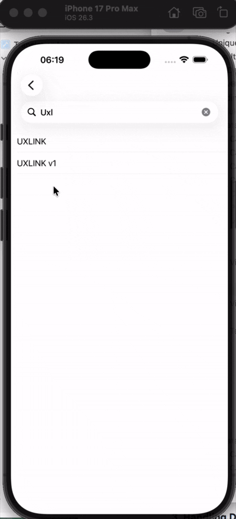

## Overview
Try YARCH architecture by adding HistogramDetailView:



[Here](GUIDE.md) are more about YARCH components.

## How to create a new module

It uses [generamba](https://github.com/rambler-digital-solutions/Generamba) for the module code generation. The catalog:
```
https://github.com/alfa-laboratory/YARCH-Template
```
To load Generamba from github(it contains highest version, that fixes issue https://github.com/strongself/Generamba/issues/242), use 
```
sh gemgit.sh https://github.com/surfstudio/Generamba.git
```

To create a new module in the example project you need to install generamba templates:
```
generamba template install
```

To create a new module you need to run following command in the terminal:
```
generamba gen [MODULE_NAME] yarch --description 'Purpose of your module.'
```
